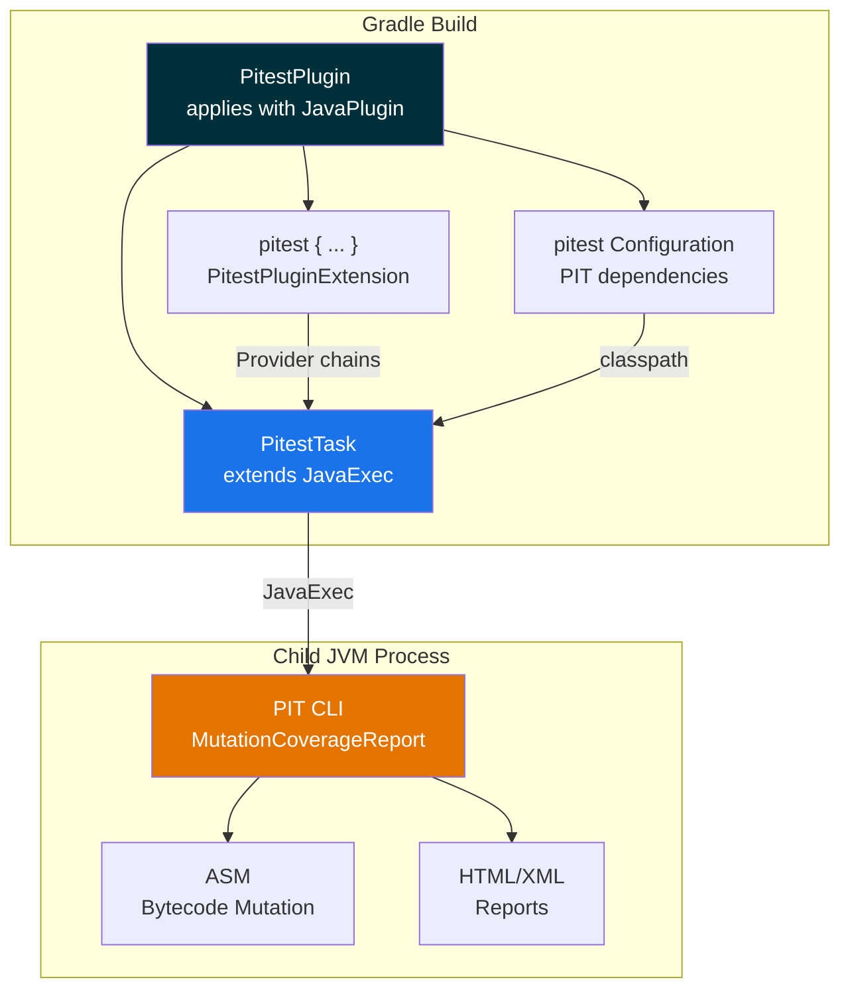

<p align="center">
  <strong>gradle-pitest-plugin</strong><br>
  Gradle plugin for PIT Mutation Testing
</p>

<p align="center">
  
  
  
  
  <a href="LICENSE-2.0.txt"></a>
</p>

---

> **Fork notice.** This is a fork of [szpak/gradle-pitest-plugin](https://github.com/szpak/gradle-pitest-plugin) with the goal of tracking the latest Gradle, JDK, and PIT versions. The upstream project targets broad compatibility (Gradle 6–8, JDK 8+); this fork targets **Gradle 9.x** and **JDK 25 LTS**.

## Quick Start

```groovy
plugins {
    id 'java'
    id 'info.solidsoft.pitest' version '2.0.0'
}

pitest {
    targetClasses = ['com.example.*']
    threads = Runtime.runtime.availableProcessors()
}
```

<details>
<summary>Kotlin DSL</summary>

```kotlin
plugins {
    java
    id("info.solidsoft.pitest") version "2.0.0"
}

pitest {
    targetClasses.set(setOf("com.example.*"))
    threads.set(Runtime.getRuntime().availableProcessors())
}
```
</details>

Run:

```bash
./gradlew pitest
```

Reports are generated in `build/reports/pitest/`.

## Architecture



## Compatibility

| | Minimum | Recommended | Tested up to |
|---|---------|-------------|-------------|
| **Gradle** | 8.4 | 9.4.1 | 9.4.1 |
| **JDK** | 17 | 25 LTS | 25.0.2 (GraalVM) |
| **PIT** | 1.7.1 | 1.23.0 | 1.23.0 |
| **Groovy** | 4.0 (Gradle 9) | 4.0.29 | 4.0.29 |

### JDK 25 Notes

PIT uses [ASM](https://asm.ow2.io/) to read and modify bytecode. PIT versions **before 1.19.0** bundle ASM 9.7 which does not support class file version 69 (JDK 25). If you use JDK 25, ensure `pitestVersion >= 1.19.0`.

### Fork vs Upstream

| Aspect | [Upstream](https://github.com/szpak/gradle-pitest-plugin) | This fork |
|--------|----------|-----------|
| Gradle | 6.x – 8.x | **8.4 – 9.4.1** |
| JDK | 8+ | **17+ (toolchain: 25)** |
| Groovy | 3.0 | **4.0** |
| Default PIT | 1.22.0 | **1.23.0** |
| Deprecation warnings | Some on Gradle 9 | **Zero** |
| CI | CircleCI (JDK 17) | **GitHub Actions (JDK 25)** |

## Multi-Module Reports

Apply the aggregator plugin to the root project:

```groovy
plugins {
    id 'info.solidsoft.pitest.aggregator' version '2.0.0'
}
```

Run:

```bash
./gradlew pitest pitestReportAggregate
```

## Documentation

Full documentation is available in [`docs/`](docs/README.md):

| # | Document | Description |
|---|----------|-------------|
| 01 | [Architecture](docs/en/01-architecture.md) | Plugin architecture, task flow, extension model |
| 02 | [Gradle Compatibility](docs/en/02-gradle-compat.md) | Gradle 9.x migration, version matrix |
| 03 | [Configuration](docs/en/03-configuration.md) | Full `pitest { }` DSL reference |
| 04 | [Development](docs/en/04-development.md) | Dev container, build commands, quality pipeline |
| 05 | [Testing](docs/en/05-testing.md) | Test suites, Gradle version regression |
| 06 | [JDK Compatibility](docs/en/06-jdk-compat.md) | JDK 25, ASM, Groovy 4, toolchains |
| 07 | [Changelog Guide](docs/en/07-changelog.md) | Release process, changelog format |

Documentation is also available in [Russian](docs/ru/README.md).

## Development

```bash
# Build dev container (Oracle Linux 10, GraalVM 17+21+25, Gradle 9.4.1)
podman build -f deployment/containerfiles/Containerfile.dev -t pitest-plugin:dev .

# Run inside container
podman run --rm -it -v .:/workspace:Z pitest-plugin:dev

# Build + test
./gradlew build funcTest

# Quality pipeline
bash scripts/quality.sh full
```

See [Development Guide](docs/en/04-development.md) for details.

## License

Licensed under the [Apache License, Version 2.0](LICENSE-2.0.txt).

Original work by [Marcin Zajączkowski](https://github.com/szpak) and [contributors](https://github.com/szpak/gradle-pitest-plugin/graphs/contributors).
