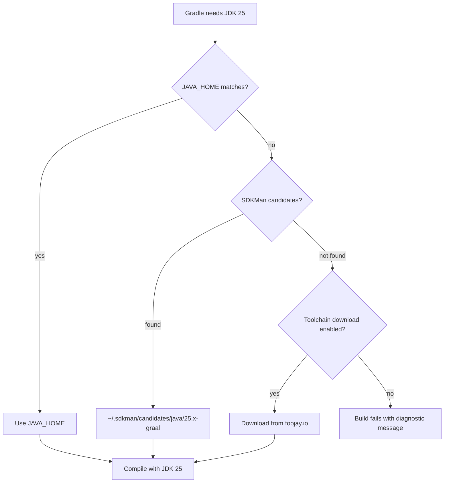
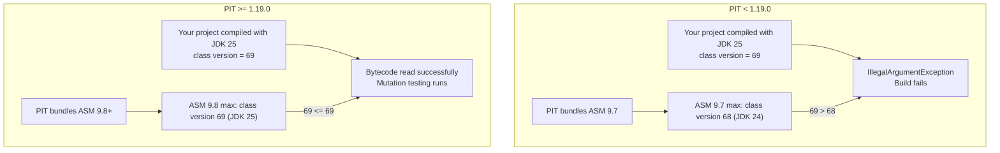
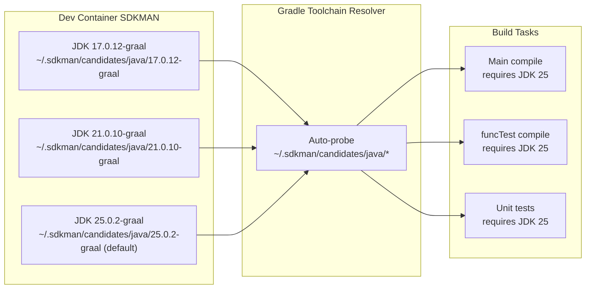

# JDK 25 Compatibility


> This document explains the JDK version support matrix, Java Toolchain configuration, the ASM bytecode compatibility chain for JDK 25, Groovy 4 migration impacts, and how the dev container provides all three GraalVM distributions for seamless toolchain auto-detection.

---

## JDK Support Matrix

| JDK Version | Role | Notes |
|-------------|------|-------|
| **JDK 25** | Primary — toolchain target | `build.gradle` toolchain set to 25; dev container default |
| **JDK 21** | Supported at runtime (LTS) | First Gradle version supporting JDK 21 is 8.4, hence the minimum Gradle requirement |
| **JDK 17** | Minimum supported | Gradle 8.4 requires Java 17; Kotlin test projects compile with `jvmTarget=17` |
| JDK 11, 8 | Not supported | Dropped when minimum Gradle was raised to 8.4 |

The plugin itself is compiled against JDK 25 bytecode (class file version 69) when built inside the dev container, but the emitted class files target `jvmTarget=17` through Gradle's toolchain configuration — this means the resulting JAR runs on JDK 17+.

---

## Java Toolchain Configuration

Gradle's [Java Toolchain](https://docs.gradle.org/current/userguide/toolchains.html) support lets you declare exactly which JDK to compile with, independent of the JDK that runs the Gradle daemon itself.

The project `build.gradle` declares JDK 25 as the toolchain:

```groovy
java {
    toolchain {
        languageVersion = JavaLanguageVersion.of(25)
    }
}
```

When Gradle resolves this declaration it searches for a matching JDK installation using the following probe order:



Inside the dev container, Gradle auto-detects all three GraalVM installations placed by SDKMAN (see [Dev Container](#dev-container-graalvm-toolchain-auto-detection) below), so no additional `javaToolchains` configuration is needed.

### Kotlin subprojects

The functional test Kotlin project pins `jvmTarget=17` explicitly to keep output class files compatible with JDK 17 at runtime, even though the compiler itself runs on JDK 25:

```kotlin
// src/funcTest/resources/testProjects/kotlin/...
kotlin {
    compilerOptions {
        jvmTarget = JvmTarget.JVM_17
    }
}
```

---

## Class File Version Reference

Each JDK release increments the `.class` file format version number. This number is embedded in every compiled `.class` file header and is the hard gate that bytecode manipulation libraries such as ASM must recognise before they can read or transform the file.

| JDK Version | Class File Version | Release Year |
|-------------|--------------------|--------------|
| JDK 17 | 61 | 2021 |
| JDK 21 | 65 | 2023 |
| JDK 24 | 68 | 2025 |
| **JDK 25** | **69** | **2025** |

The formula is straightforward: `class_version = JDK_major + 44`. JDK 25 therefore produces class files with major version 69 (`0x45` in the 4-byte magic sequence at offset 6 of every `.class` file).

---

## ASM Compatibility Problem

### Why ASM matters for PIT

PIT (PITest mutation testing engine) uses the [ASM](https://asm.ow2.io/) bytecode manipulation library to:

1. Read compiled `.class` files from the project under test
2. Insert mutation probes at bytecode level (e.g., negate boolean conditions, replace arithmetic operators)
3. Write modified bytecode back to a temporary classloader for test execution

If ASM encounters a class file version it does not recognise, it throws an `IllegalArgumentException` and the entire PIT run aborts with a cryptic error.

### Version chain



### ASM version support table

| ASM Version | Maximum Supported Class Version | Maximum JDK |
|-------------|--------------------------------|-------------|
| 9.6 | 67 | JDK 23 |
| 9.7 | 68 | JDK 24 |
| **9.8+** | **69** | **JDK 25** |

### How the plugin handles this

The functional test suite detects the running JVM version at test time and skips PIT versions known to be incompatible:

```groovy
// PitestPluginPitVersionFunctionalSpec.groovy
private List<String> getPitVersionsCompatibleWithCurrentJavaVersion() {
    List<String> pitVersions = [MINIMAL_SUPPORTED_PIT_VERSION, "1.17.1", "1.18.0", PitestPlugin.DEFAULT_PITEST_VERSION]
    if (JavaVersion.current() > JavaVersion.VERSION_17) {
        pitVersions.remove(MINIMAL_SUPPORTED_PIT_VERSION)
    }
    // PIT < 1.19.0 uses ASM 9.7.x which doesn't support class file version 69 (JDK 25)
    if (JavaVersion.current() >= JavaVersion.VERSION_25) {
        pitVersions.removeAll { String v -> GradleVersion.version(v) < GradleVersion.version("1.19.0") }
    }
    return pitVersions
}
```

The default PIT version shipped with this plugin (`DEFAULT_PITEST_VERSION = "1.23.0"`) already bundles ASM 9.8+ and is therefore fully compatible with JDK 25 out of the box.

### Known test exclusion on JDK 25+

The `RegularFileProperty historyInputLocation` test is skipped when running on JDK 25+. This is a PIT-internal issue unrelated to ASM — PIT produces an internal error when resolving the history file path under some JDK 25 security manager configurations. The skip guard is in place until an upstream fix is released.

---

## Groovy 4 Impacts

Gradle 9 embeds Groovy 4 as its scripting engine. The plugin itself is compiled with the `localGroovy()` dependency, which means it always compiles against the Groovy version shipped with the target Gradle distribution. Several Groovy 4 breaking changes affect how the plugin is written.

### Abstract class requirement for tasks with @Inject

Groovy 4 enforces that classes with `@Inject`-annotated constructors or methods must be declared `abstract` when they extend a class that already provides those injections (such as Gradle's `JavaExec`). A concrete class silently failing at runtime in Groovy 3 is a hard compile error in Groovy 4.

`PitestTask` is therefore declared as an `abstract class`:

```groovy
@CompileStatic
@CacheableTask
abstract class PitestTask extends JavaExec {
    // Gradle's ObjectFactory and WorkerExecutor @Inject methods are resolved
    // by Gradle's decoration mechanism, not by a concrete constructor.
    // Groovy 4 requires 'abstract' here.
}
```

If you create a custom task that extends `PitestTask`, it must also be `abstract` unless it provides a concrete constructor that satisfies all `@Inject` requirements.

### Stricter type coercion — NamedDomainObjectProvider requires .get()

Groovy 3 would silently coerce a `NamedDomainObjectProvider<T>` to `T` in many contexts through dynamic dispatch. Groovy 4 with `@CompileStatic` rejects this implicit unwrapping. Anywhere a provider value is consumed it must be explicitly resolved:

```groovy
// Groovy 3 — worked by accident
SourceSet mainSet = sourceSets["main"]

// Groovy 4 with @CompileStatic — explicit resolution required
SourceSet mainSet = sourceSets.named("main").get()
```

In this plugin, lazy provider resolution is the design preference — use `.map {}` and `.flatMap {}` chains rather than `.get()` at configuration time, which would break configuration cache:

```groovy
// Preferred: lazy chain, evaluated at execution time
extension.testSourceSets.set(
    javaSourceSets.named(SourceSet.TEST_SOURCE_SET_NAME).map { SourceSet ss -> [ss] }
)
```

### Package rename: org.codehaus.groovy → org.apache.groovy

The Groovy project moved its Maven group and base package from `org.codehaus.groovy` to `org.apache.groovy` in Groovy 4. This affects:

| Area | Groovy 3 | Groovy 4 |
|------|----------|----------|
| Maven group | `org.codehaus.groovy` | `org.apache.groovy` |
| Import prefix | `org.codehaus.groovy.*` | `org.apache.groovy.*` |
| Artifact name | `groovy-all` | `groovy` (module system) |

The `build.gradle` excludes the old group from Spock to prevent classpath conflicts:

```groovy
testImplementation('org.spockframework:spock-core:2.4-groovy-4.0') {
    exclude group: 'org.apache.groovy'   // provided by localGroovy()
}
funcTestImplementation('com.netflix.nebula:nebula-test:12.0.0') {
    exclude group: 'org.apache.groovy', module: 'groovy-all'
}
```

### DELEGATE_FIRST closure behavior change

Groovy 4 tightened the resolution strategy for closures with `@DelegatesTo(strategy = Closure.DELEGATE_FIRST)`. In Groovy 3, an unresolved property would silently fall through to the owner; in Groovy 4 with `@CompileStatic`, this is a compile-time error.

The practical impact in this plugin: all closures passed to `configureEach` and `withType` must use unambiguous property access. When in doubt, explicitly qualify with `it.` to reference the delegate:

```groovy
// Correct under Groovy 4
tasks.withType(CodeNarc).configureEach { codeNarcTask ->
    codeNarcTask.reports {
        text.required = true
        html.required = true
    }
}
```

---

## Dev Container: GraalVM Toolchain Auto-Detection

The development container (`deployment/containerfiles/Containerfile.dev`) installs three GraalVM distributions via SDKMAN to cover all supported JDK targets simultaneously:

| SDKMAN identifier | JDK version | Purpose |
|-------------------|-------------|---------|
| `17.0.12-graal` | JDK 17 | Minimum supported runtime; functional test matrix |
| `21.0.10-graal` | JDK 21 | LTS runtime; first JDK with virtual threads |
| `25.0.2-graal` | JDK 25 | Primary toolchain target; container default (`sdk default`) |

SDKMAN installs each distribution under `~/.sdkman/candidates/java/<version>-graal/`. Gradle's [Foojay Toolchain Resolver](https://docs.gradle.org/current/userguide/toolchains.html#sub:download_repositories) probes these locations automatically at startup, so no manual `javaToolchains.installations` block is required.



The `JAVA_HOME` environment variable points to the current SDKMAN default (JDK 25), which is also the JDK that runs the Gradle daemon itself.

---

## Full Compatibility Matrix

The table below summarises what works, what works with caveats, and what does not work across the relevant version combination space.

| JDK | Gradle | PIT | Works? | Notes |
|-----|--------|-----|--------|-------|
| 17 | 8.4 | 1.17.x+ | Yes | Minimum supported combination |
| 17 | 8.4 | 1.7.1 | Yes | Oldest tested PIT version |
| 21 | 8.4+ | 1.17.1+ | Yes | JDK 21 minimum is Gradle 8.4 |
| 21 | 8.4+ | 1.7.1 | No | PIT < 1.17.x has issues on JDK 21 |
| 25 | 8.4+ | < 1.19.0 | No | ASM 9.7 cannot read class version 69 |
| 25 | 8.4+ | 1.19.0+ | Yes | ASM 9.8+ supports class version 69 |
| 25 | 9.4.1 | 1.23.0 | Yes | Primary development combination |
| 25 | 9.4.1 | 1.23.0 | Partial | `historyInputLocation` test skipped |

### Functional test matrix coverage

The functional test suite (`PitestPluginPitVersionFunctionalSpec`) tests the following PIT versions in CI, with automatic exclusions applied based on the detected JVM:

- `1.7.1` — excluded on JDK 21+
- `1.17.1` — excluded on JDK 25+ (ASM 9.7)
- `1.18.0` — excluded on JDK 25+ (ASM 9.7)
- `1.23.0` — runs on all supported JDK versions

The Gradle version matrix (`PitestPluginGradleVersionFunctionalSpec`) covers Gradle 6.x through 9.4.1. Not all combinations of Gradle version and JDK are valid — the suite applies its own version guards to skip combinations that are known to be structurally incompatible (e.g., Gradle 6.x does not support JDK 21+).

---

## See Also

- [Gradle Java Toolchains documentation](https://docs.gradle.org/current/userguide/toolchains.html)
- [ASM changelog](https://gitlab.ow2.org/asm/asm/-/blob/master/CHANGELOG.md) — class version support history
- [PIT release notes](https://pitest.org/release_notes/) — ASM upgrade tracking
- [Groovy 4 migration guide](https://groovy-lang.org/releasenotes/groovy-4.0.html) — breaking changes from Groovy 3
- [`07-changelog.md`](./07-changelog.md) — project changelog and release process
