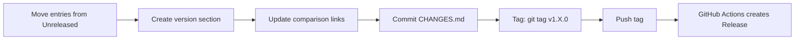

# Changelog Guide


> How to maintain the project changelog following [Keep a Changelog 1.1.0](https://keepachangelog.com/en/1.1.0/) and [Semantic Versioning](https://semver.org/spec/v2.0.0.html).

---

## Format

The changelog file is `CHANGES.md` at the repository root:

```markdown
# Changelog

All notable changes to this project will be documented in this file.

The format is based on [Keep a Changelog](https://keepachangelog.com/en/1.1.0/).

## [Unreleased]

### Added
- New feature description.

## [1.20.0] - 2026-04-15

### Changed
- Behavior modification.

### Fixed
- Bug fix description.

[Unreleased]: https://github.com/dantte-lp/gradle-pitest-plugin/compare/v1.20.0...HEAD
[1.20.0]: https://github.com/dantte-lp/gradle-pitest-plugin/releases/tag/v1.20.0
```

## Section Types

| Section | When to use |
|---------|-------------|
| **Added** | New features, capabilities, properties |
| **Changed** | Modified existing behavior, dependency updates |
| **Deprecated** | Features marked for future removal |
| **Removed** | Deleted features, removed deprecated APIs |
| **Fixed** | Bug fixes |
| **Security** | Vulnerability fixes |

## Writing Good Entries

- Start with a verb: "Add", "Fix", "Remove", "Update"
- Write for plugin **users**, not developers
- Reference Gradle versions when relevant (e.g., "Remove deprecated `Configuration.visible` (Gradle 9.1+)")
- Keep entries concise — one line per change
- Group dependency updates under "Changed — Dependencies"

## Release Process



1. Move entries from `[Unreleased]` to a new version section
2. Add date in ISO 8601 format
3. Update comparison links at the bottom
4. Commit: `git commit -m "release: v1.X.0"`
5. Tag: `git tag v1.X.0`
6. Push: `git push origin v1.X.0`
7. GitHub Actions automatically creates a Release with changelog as body
