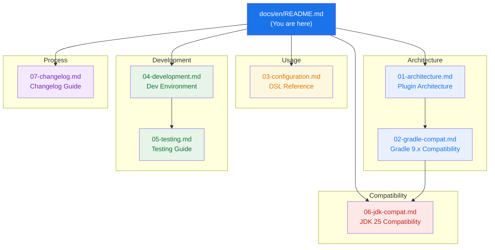

# gradle-pitest-plugin Documentation

> Technical documentation for **gradle-pitest-plugin** — a Gradle plugin for [PIT mutation testing](https://pitest.org/). This fork targets Gradle 9.x and JDK 25 LTS.

---

## Documentation Map

## Document Index

| # | Document | Description |
|---|----------|-------------|
| 01 | [Architecture](01-architecture.md) | Plugin architecture, task flow, extension model, package structure |
| 02 | [Gradle Compatibility](02-gradle-compat.md) | Gradle 9.x breaking changes, migration details, version matrix |
| 03 | [Configuration](03-configuration.md) | Full DSL reference — all `pitest { }` properties with examples |
| 04 | [Development](04-development.md) | Dev container, build commands, quality pipeline |
| 05 | [Testing](05-testing.md) | Unit tests, functional tests, Gradle version regression matrix |
| 06 | [JDK Compatibility](06-jdk-compat.md) | JDK 25 support, ASM constraints, Groovy 4 impacts, toolchains |
| 07 | [Changelog Guide](07-changelog.md) | How to maintain CHANGES.md, release process |

## Quick Links

- [Plugin DSL Reference](03-configuration.md) — start here if you're using the plugin
- [Dev Container Setup](04-development.md#dev-container) — start here if you're contributing
- [Gradle 9.x Migration](02-gradle-compat.md) — what changed and why
- [JDK 25 Notes](06-jdk-compat.md) — ASM/PIT version constraints

## Other Languages

- [Русский (Russian)](../ru/README.md)
