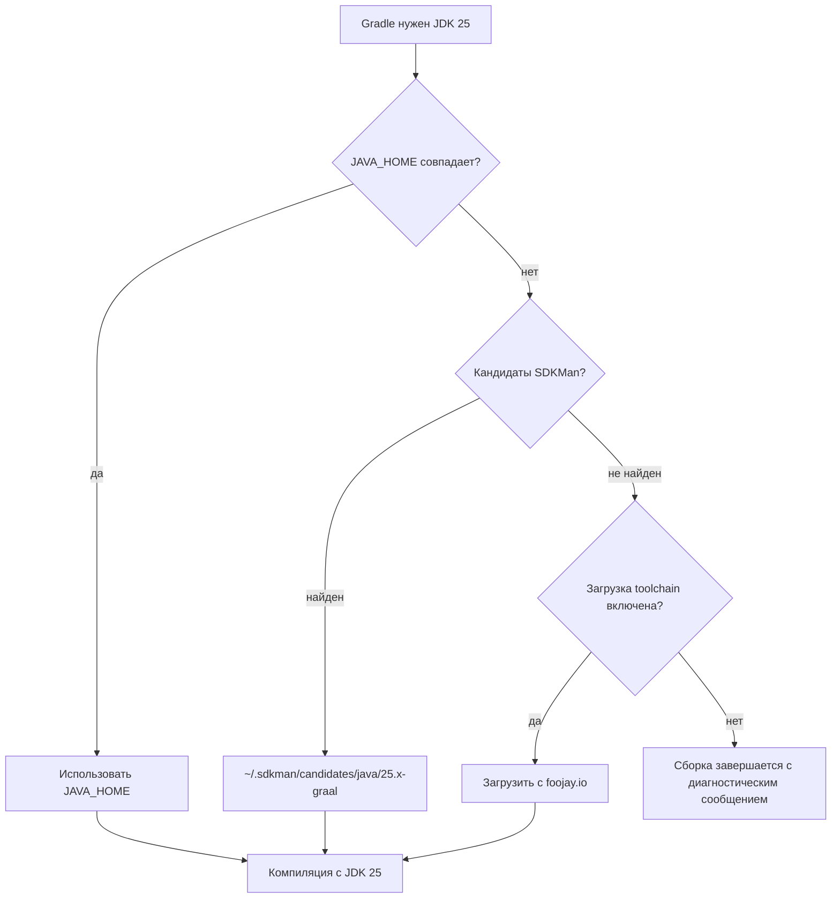
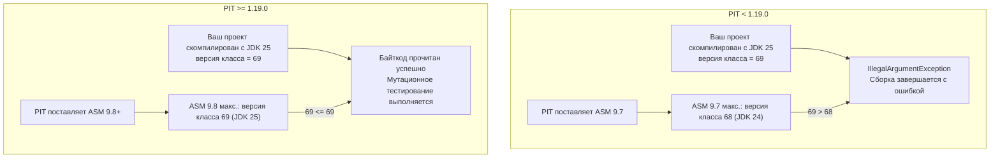
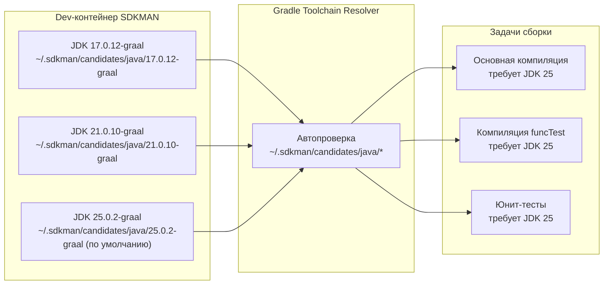

# Совместимость с JDK 25


> Этот документ объясняет матрицу поддержки версий JDK, конфигурацию Java Toolchain, цепочку
> совместимости байткода ASM для JDK 25, влияние миграции на Groovy 4 и то, как dev-контейнер
> предоставляет все три дистрибутива GraalVM для бесшовного автообнаружения toolchain.

---

## Матрица поддержки JDK

| Версия JDK | Роль | Примечания |
|-------------|------|-------|
| **JDK 25** | Основная — целевой toolchain | Toolchain в `build.gradle` настроен на 25; по умолчанию в dev-контейнере |
| **JDK 21** | Поддерживается во время выполнения (LTS) | Первая версия Gradle, поддерживающая JDK 21, — 8.4, откуда и минимальное требование к Gradle |
| **JDK 17** | Минимально поддерживаемая | Gradle 8.4 требует Java 17; тестовые проекты Kotlin компилируются с `jvmTarget=17` |
| JDK 11, 8 | Не поддерживается | Исключены при повышении минимального Gradle до 8.4 |

Плагин компилируется против байткода JDK 25 (версия class-файла 69) при сборке внутри
dev-контейнера, но генерируемые class-файлы нацелены на `jvmTarget=17` через конфигурацию
toolchain Gradle — это означает, что итоговый JAR работает на JDK 17+.

---

## Конфигурация Java Toolchain

Поддержка [Java Toolchain](https://docs.gradle.org/current/userguide/toolchains.html) в Gradle
позволяет точно указать, с каким JDK компилировать, независимо от JDK, запускающего демон Gradle.

В `build.gradle` проекта объявлен JDK 25 в качестве toolchain:

```groovy
java {
    toolchain {
        languageVersion = JavaLanguageVersion.of(25)
    }
}
```

При разрешении этого объявления Gradle ищет подходящую установку JDK в следующем порядке:



Внутри dev-контейнера Gradle автоматически обнаруживает все три установки GraalVM, размещённые
SDKMAN (см. раздел [Dev-контейнер](#dev-контейнер-автообнаружение-toolchain-graalvm) ниже),
поэтому дополнительная конфигурация `javaToolchains` не требуется.

### Kotlin-подпроекты

Функциональный тестовый Kotlin-проект явно задаёт `jvmTarget=17`, чтобы выходные class-файлы
оставались совместимы с JDK 17 во время выполнения, даже несмотря на то, что компилятор сам
работает на JDK 25:

```kotlin
// src/funcTest/resources/testProjects/kotlin/...
kotlin {
    compilerOptions {
        jvmTarget = JvmTarget.JVM_17
    }
}
```

---

## Справочник версий class-файлов

Каждый выпуск JDK увеличивает номер версии формата `.class`-файла. Этот номер встраивается в
заголовок каждого скомпилированного `.class`-файла и является жёстким порогом, который библиотеки
байткод-манипуляций, такие как ASM, должны распознать, прежде чем смогут читать или трансформировать
файл.

| Версия JDK | Версия class-файла | Год выпуска |
|-------------|--------------------|--------------|
| JDK 17 | 61 | 2021 |
| JDK 21 | 65 | 2023 |
| JDK 24 | 68 | 2025 |
| **JDK 25** | **69** | **2025** |

Формула проста: `версия_класса = мажорная_версия_JDK + 44`. Таким образом, JDK 25 создаёт
class-файлы с мажорной версией 69 (`0x45` в 4-байтовой magic-последовательности со смещением 6
в каждом `.class`-файле).

---

## Проблема совместимости ASM

### Зачем ASM важен для PIT

PIT (движок мутационного тестирования PITest) использует библиотеку байткод-манипуляций
[ASM](https://asm.ow2.io/) для:

1. Чтения скомпилированных `.class`-файлов тестируемого проекта
2. Вставки мутационных зондов на уровне байткода (напр., инверсия булевых условий, замена
   арифметических операторов)
3. Записи изменённого байткода обратно во временный classloader для выполнения тестов

Если ASM встречает версию class-файла, которую не распознаёт, он выбрасывает
`IllegalArgumentException`, и весь запуск PIT прерывается с неочевидной ошибкой.

### Цепочка версий



### Таблица поддерживаемых версий ASM

| Версия ASM | Максимальная поддерживаемая версия класса | Максимальный JDK |
|-------------|--------------------------------|-------------|
| 9.6 | 67 | JDK 23 |
| 9.7 | 68 | JDK 24 |
| **9.8+** | **69** | **JDK 25** |

### Как плагин обрабатывает это

Функциональный набор тестов определяет версию JVM во время выполнения и пропускает версии PIT,
заведомо несовместимые:

```groovy
// PitestPluginPitVersionFunctionalSpec.groovy
private List<String> getPitVersionsCompatibleWithCurrentJavaVersion() {
    List<String> pitVersions = [MINIMAL_SUPPORTED_PIT_VERSION, "1.17.1", "1.18.0", PitestPlugin.DEFAULT_PITEST_VERSION]
    if (JavaVersion.current() > JavaVersion.VERSION_17) {
        pitVersions.remove(MINIMAL_SUPPORTED_PIT_VERSION)
    }
    // PIT < 1.19.0 использует ASM 9.7.x, который не поддерживает class-файл версии 69 (JDK 25)
    if (JavaVersion.current() >= JavaVersion.VERSION_25) {
        pitVersions.removeAll { String v -> GradleVersion.version(v) < GradleVersion.version("1.19.0") }
    }
    return pitVersions
}
```

Версия PIT по умолчанию, поставляемая с этим плагином (`DEFAULT_PITEST_VERSION = "1.23.0"`),
уже включает ASM 9.8+ и, следовательно, полностью совместима с JDK 25 без дополнительной
настройки.

### Известное исключение теста на JDK 25+

Тест `RegularFileProperty historyInputLocation` пропускается при работе на JDK 25+. Это
внутренняя проблема PIT, не связанная с ASM — PIT выдаёт внутреннюю ошибку при разрешении пути
файла истории под некоторыми конфигурациями менеджера безопасности JDK 25. Защита от пропуска
действует до выпуска исправления в upstream.

---

## Влияние Groovy 4

Gradle 9 встраивает Groovy 4 в качестве своего движка скриптов. Плагин компилируется с зависимостью
`localGroovy()`, что означает его всегда компилируется против версии Groovy, поставляемой с целевым
дистрибутивом Gradle. Несколько критических изменений Groovy 4 влияют на написание плагина.

### Требование abstract-класса для задач с @Inject

Groovy 4 требует, чтобы классы с конструкторами или методами, аннотированными `@Inject`, были
объявлены `abstract`, когда они расширяют класс, уже предоставляющий эти инъекции (такой как
`JavaExec` Gradle). Конкретный класс, молча падающий во время выполнения в Groovy 3, становится
жёсткой ошибкой компиляции в Groovy 4.

Поэтому `PitestTask` объявлена как `abstract class`:

```groovy
@CompileStatic
@CacheableTask
abstract class PitestTask extends JavaExec {
    // Методы @Inject ObjectFactory и WorkerExecutor разрешаются
    // механизмом декорации Gradle, а не конкретным конструктором.
    // Groovy 4 требует 'abstract' здесь.
}
```

Если вы создаёте пользовательскую задачу, расширяющую `PitestTask`, она также должна быть
`abstract`, если только она не предоставляет конкретный конструктор, удовлетворяющий всем
требованиям `@Inject`.

### Более строгое приведение типов — NamedDomainObjectProvider требует .get()

Groovy 3 молча приводил `NamedDomainObjectProvider<T>` к `T` во многих контекстах через
динамическую диспетчеризацию. Groovy 4 с `@CompileStatic` отвергает это неявное разворачивание.
Везде, где потребляется значение провайдера, оно должно быть явно разрешено:

```groovy
// Groovy 3 — работало случайно
SourceSet mainSet = sourceSets["main"]

// Groovy 4 с @CompileStatic — требуется явное разрешение
SourceSet mainSet = sourceSets.named("main").get()
```

В этом плагине ленивое разрешение провайдеров является предпочтительным подходом — используйте
цепочки `.map {}` и `.flatMap {}` вместо `.get()` во время конфигурации, что нарушало бы кэш
конфигурации:

```groovy
// Предпочтительно: ленивая цепочка, вычисляемая во время выполнения
extension.testSourceSets.set(
    javaSourceSets.named(SourceSet.TEST_SOURCE_SET_NAME).map { SourceSet ss -> [ss] }
)
```

### Переименование пакета: org.codehaus.groovy → org.apache.groovy

Проект Groovy перенёс свою Maven-группу и базовый пакет с `org.codehaus.groovy` на
`org.apache.groovy` в Groovy 4. Это затрагивает:

| Область | Groovy 3 | Groovy 4 |
|------|----------|----------|
| Maven-группа | `org.codehaus.groovy` | `org.apache.groovy` |
| Префикс импорта | `org.codehaus.groovy.*` | `org.apache.groovy.*` |
| Имя артефакта | `groovy-all` | `groovy` (модульная система) |

`build.gradle` исключает старую группу из Spock для предотвращения конфликтов в classpath:

```groovy
testImplementation('org.spockframework:spock-core:2.4-groovy-4.0') {
    exclude group: 'org.apache.groovy'   // предоставляется localGroovy()
}
funcTestImplementation('com.netflix.nebula:nebula-test:12.0.0') {
    exclude group: 'org.apache.groovy', module: 'groovy-all'
}
```

### Изменение поведения замыканий DELEGATE_FIRST

Groovy 4 ужесточил стратегию разрешения для замыканий с `@DelegatesTo(strategy = Closure.DELEGATE_FIRST)`.
В Groovy 3 неразрешённое свойство молча передавалось владельцу; в Groovy 4 с `@CompileStatic`
это ошибка компиляции.

Практическое влияние на этот плагин: все замыкания, передаваемые в `configureEach` и `withType`,
должны использовать однозначный доступ к свойствам. При необходимости явно квалифицируйте с `it.`
для ссылки на делегат:

```groovy
// Правильно под Groovy 4
tasks.withType(CodeNarc).configureEach { codeNarcTask ->
    codeNarcTask.reports {
        text.required = true
        html.required = true
    }
}
```

---

## Dev-контейнер: автообнаружение toolchain GraalVM

Dev-контейнер (`deployment/containerfiles/Containerfile.dev`) устанавливает три дистрибутива
GraalVM через SDKMAN для одновременного охвата всех поддерживаемых целей JDK:

| Идентификатор SDKMAN | Версия JDK | Назначение |
|-------------------|-------------|---------|
| `17.0.12-graal` | JDK 17 | Минимально поддерживаемая среда выполнения; матрица функциональных тестов |
| `21.0.10-graal` | JDK 21 | LTS среда выполнения; первый JDK с виртуальными потоками |
| `25.0.2-graal` | JDK 25 | Основная целевая версия toolchain; по умолчанию в контейнере (`sdk default`) |

SDKMAN устанавливает каждый дистрибутив в `~/.sdkman/candidates/java/<version>-graal/`. [Foojay
Toolchain Resolver](https://docs.gradle.org/current/userguide/toolchains.html#sub:download_repositories)
Gradle автоматически проверяет эти пути при запуске, поэтому ручной блок `javaToolchains.installations`
не требуется.



Переменная окружения `JAVA_HOME` указывает на текущий SDKMAN-default (JDK 25), который также
является JDK, запускающим демон Gradle.

---

## Полная матрица совместимости

Таблица ниже обобщает, что работает, что работает с оговорками, а что не работает в релевантном
пространстве комбинаций версий.

| JDK | Gradle | PIT | Работает? | Примечания |
|-----|--------|-----|--------|-------|
| 17 | 8.4 | 1.17.x+ | Да | Минимальная поддерживаемая комбинация |
| 17 | 8.4 | 1.7.1 | Да | Старейшая тестируемая версия PIT |
| 21 | 8.4+ | 1.17.1+ | Да | Минимум JDK 21 — это Gradle 8.4 |
| 21 | 8.4+ | 1.7.1 | Нет | PIT < 1.17.x имеет проблемы на JDK 21 |
| 25 | 8.4+ | < 1.19.0 | Нет | ASM 9.7 не может читать class-версию 69 |
| 25 | 8.4+ | 1.19.0+ | Да | ASM 9.8+ поддерживает class-версию 69 |
| 25 | 9.4.1 | 1.23.0 | Да | Основная комбинация разработки |
| 25 | 9.4.1 | 1.23.0 | Частично | Тест `historyInputLocation` пропускается |

### Покрытие матрицей функциональных тестов

Функциональный набор тестов (`PitestPluginPitVersionFunctionalSpec`) тестирует следующие версии
PIT в CI с автоматическим применением исключений на основе обнаруженного JVM:

- `1.7.1` — исключено на JDK 21+
- `1.17.1` — исключено на JDK 25+ (ASM 9.7)
- `1.18.0` — исключено на JDK 25+ (ASM 9.7)
- `1.23.0` — запускается на всех поддерживаемых версиях JDK

Матрица версий Gradle (`PitestPluginGradleVersionFunctionalSpec`) охватывает Gradle 6.x до 9.4.1.
Не все комбинации версии Gradle и JDK допустимы — набор применяет собственные защиты версий для
пропуска комбинаций, структурно несовместимых (напр., Gradle 6.x не поддерживает JDK 21+).

---

## См. также

- [Документация Java Toolchains Gradle](https://docs.gradle.org/current/userguide/toolchains.html)
- [Журнал изменений ASM](https://gitlab.ow2.org/asm/asm/-/blob/master/CHANGELOG.md) — история поддержки версий классов
- [Примечания к выпускам PIT](https://pitest.org/release_notes/) — отслеживание обновлений ASM
- [Руководство по миграции на Groovy 4](https://groovy-lang.org/releasenotes/groovy-4.0.html) — критические изменения по сравнению с Groovy 3
- [`07-changelog.md`](./07-changelog.md) — журнал изменений проекта и процесс выпуска
