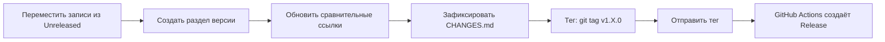

# Руководство по ведению журнала изменений


> Как поддерживать журнал изменений проекта, следуя [Keep a Changelog 1.1.0](https://keepachangelog.com/en/1.1.0/)
> и [Семантическому версионированию](https://semver.org/spec/v2.0.0.html).

---

## Формат

Файл журнала изменений — `CHANGES.md` в корне репозитория:

```markdown
# Changelog

All notable changes to this project will be documented in this file.

The format is based on [Keep a Changelog](https://keepachangelog.com/en/1.1.0/).

## [Unreleased]

### Added
- New feature description.

## [1.20.0] - 2026-04-15

### Changed
- Behavior modification.

### Fixed
- Bug fix description.

[Unreleased]: https://github.com/dantte-lp/gradle-pitest-plugin/compare/v1.20.0...HEAD
[1.20.0]: https://github.com/dantte-lp/gradle-pitest-plugin/releases/tag/v1.20.0
```

## Типы разделов

| Раздел | Когда использовать |
|---------|-------------|
| **Added** | Новые функции, возможности, свойства |
| **Changed** | Изменённое существующее поведение, обновления зависимостей |
| **Deprecated** | Функции, помеченные для будущего удаления |
| **Removed** | Удалённые функции, убранные устаревшие API |
| **Fixed** | Исправления ошибок |
| **Security** | Исправления уязвимостей |

## Написание хороших записей

- Начинайте с глагола: "Add", "Fix", "Remove", "Update"
- Пишите для **пользователей** плагина, не для разработчиков
- Указывайте версии Gradle, если это уместно (напр., "Remove deprecated `Configuration.visible` (Gradle 9.1+)")
- Держите записи краткими — одна строка на изменение
- Группируйте обновления зависимостей под "Changed — Dependencies"

## Процесс выпуска



1. Переместить записи из `[Unreleased]` в новый раздел версии
2. Добавить дату в формате ISO 8601
3. Обновить сравнительные ссылки внизу
4. Зафиксировать: `git commit -m "release: v1.X.0"`
5. Поставить тег: `git tag v1.X.0`
6. Отправить: `git push origin v1.X.0`
7. GitHub Actions автоматически создаёт Release с журналом изменений в теле
