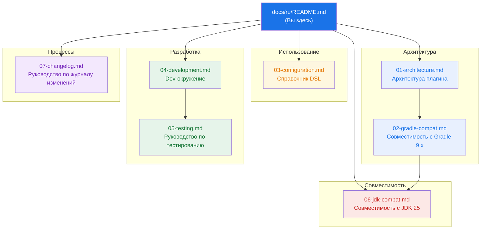

# Документация gradle-pitest-plugin

> Техническая документация для **gradle-pitest-plugin** — Gradle-плагина для
> [мутационного тестирования PIT](https://pitest.org/). Этот форк ориентирован на Gradle 9.x
> и JDK 25 LTS.

---

## Карта документации

## Указатель документов

| # | Документ | Описание |
|---|----------|-------------|
| 01 | [Архитектура](01-architecture.md) | Архитектура плагина, поток задач, модель расширения, структура пакетов |
| 02 | [Совместимость с Gradle](02-gradle-compat.md) | Критические изменения Gradle 9.x, подробности миграции, матрица версий |
| 03 | [Конфигурация](03-configuration.md) | Полный справочник DSL — все свойства `pitest { }` с примерами |
| 04 | [Разработка](04-development.md) | Dev-контейнер, команды сборки, конвейер качества |
| 05 | [Тестирование](05-testing.md) | Юнит-тесты, функциональные тесты, матрица регрессии версий Gradle |
| 06 | [Совместимость с JDK](06-jdk-compat.md) | Поддержка JDK 25, ограничения ASM, влияние Groovy 4, toolchain |
| 07 | [Руководство по журналу изменений](07-changelog.md) | Как поддерживать CHANGES.md, процесс выпуска |

## Быстрые ссылки

- [Справочник DSL плагина](03-configuration.md) — начните здесь, если вы используете плагин
- [Настройка dev-контейнера](04-development.md#настройка-dev-контейнера) — начните здесь, если вы вносите вклад
- [Миграция на Gradle 9.x](02-gradle-compat.md) — что изменилось и почему
- [Примечания о JDK 25](06-jdk-compat.md) — ограничения версий ASM/PIT

## Другие языки

- [English](../en/README.md)
